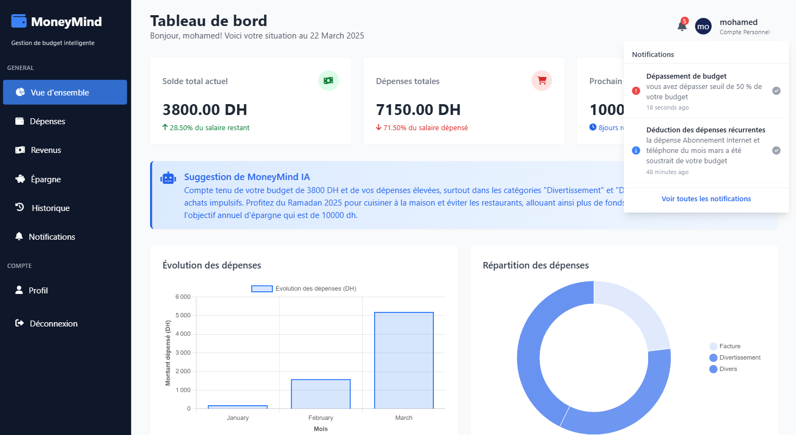
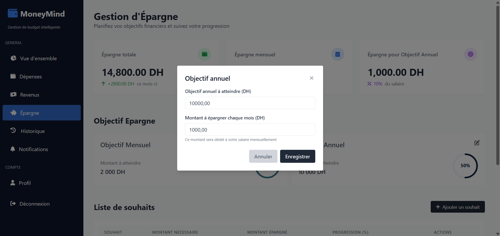
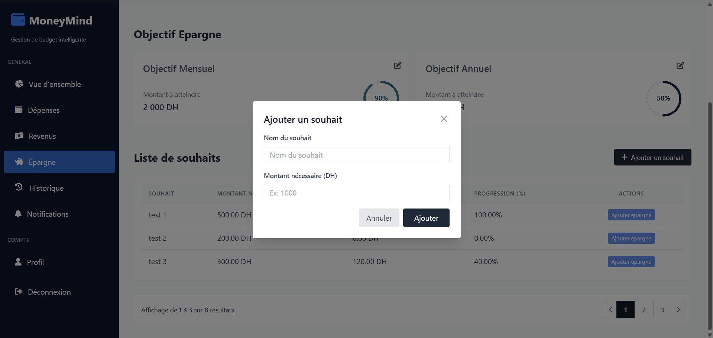
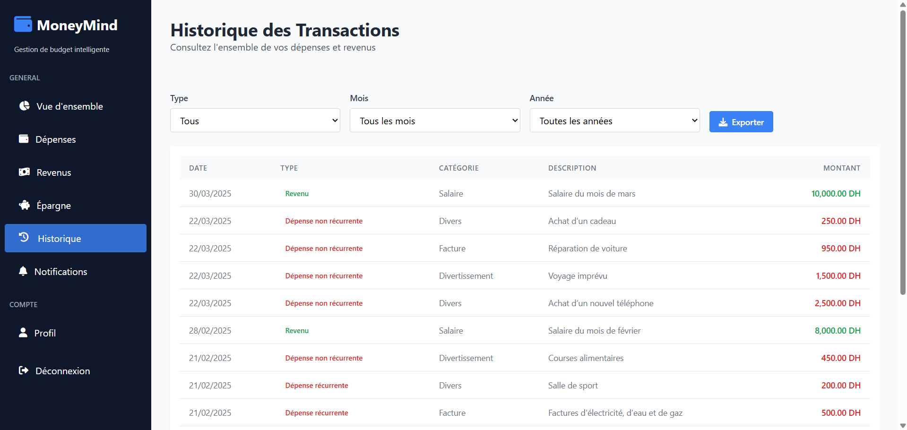
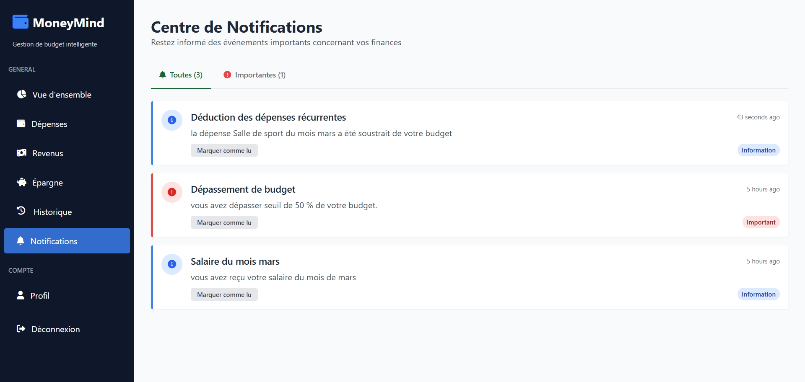
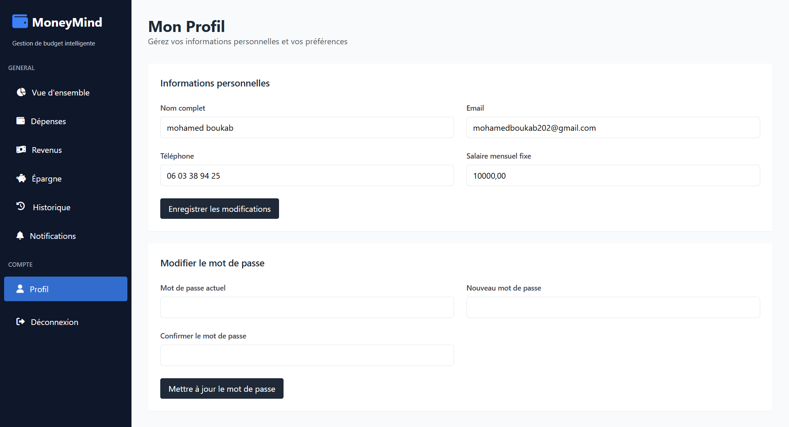
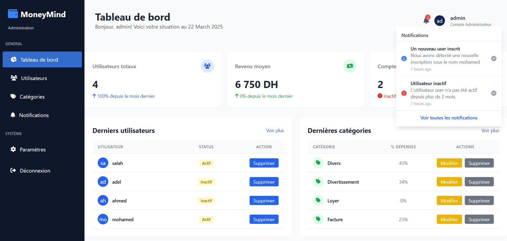
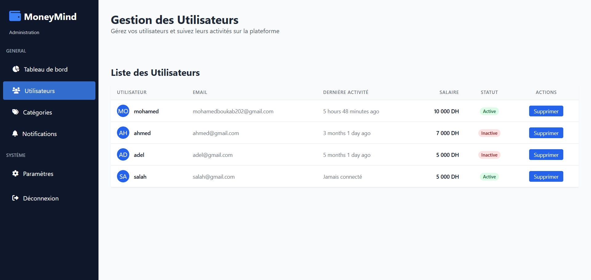
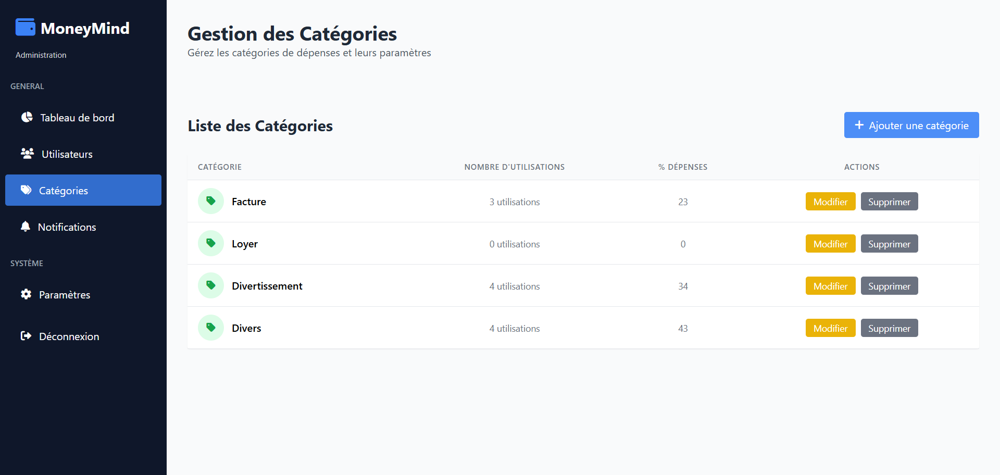

# MoneyMind - Application de Gestion Financière Personnelle 

[](https://laravel.com)
[](https://php.net)

## À propos de MoneyMind

MoneyMind est une application web moderne de gestion financière personnelle développée avec Laravel. Elle permet aux utilisateurs de prendre le contrôle de leurs finances en suivant leurs revenus, dépenses, objectifs d'épargne mensuel et annuel, liste des souhaits d'achat futur. L'application automatise également toutes les transactions récurrentes que ce soit la déduction des dépenses ou la réception du revenu mensuel, ainsi qu'elle propose des conseils personnalisés grâce à l'intégration de l'IA Gemini pour une meilleure gestion budgétaire, avec aussi un système d'alertes (par envoi d'un rapport par email) et de notifications en temps réel et une liste d'historique de toutes les transactions.

## Fonctionnalités principales

### Pour les utilisateurs
- **Tableau de bord personnalisé** : Vue d'ensemble de votre situation financière avec statistiques détaillées
- **Gestion des revenus** : Configuration du salaire mensuel avec date de crédit automatique
- **Suivi des dépenses** : Catégorisation et analyse des dépenses quotidiennes
- **Dépenses récurrentes** : Automatisation des paiements réguliers (loyer, abonnements, etc.)
- **Objectifs d'épargne** : Définition et suivi des objectifs financiers mensuels et annuels
- **Liste de souhaits** : Planification des achats futurs avec suivi de progression 
- **Alertes budgétaires** : Envoi d'un rapport sur sa situation par mail lorsque les dépenses dépassent un seuil défini
- **Notification en temps réel** : Envoi des notifications pour les alertes budgétaires, les réceptions des salaires et les déductions des dépenses mensuelles
- **Historique des transactions** : Journal complet avec filtrage avancé (par mois, année, type de transaction)
- **Conseils IA** : Recommandations personnalisées basées sur vos habitudes financières

### Pour les administrateurs
- **Tableau de bord administratif** : Statistiques globales sur les utilisateurs et leurs finances
- **Gestion des utilisateurs** : Suivi et suppression des comptes inactifs depuis plus de 2 mois
- **Gestion des catégories** : Création et modification des catégories de dépenses
- **Notifications système** : Alertes sur les nouveaux utilisateurs et les comptes inactifs

## Technologies utilisées

- **Backend** : Laravel 11 (PHP 8.2.12)
- **Frontend** : Blade, TailwindCSS, JavaScript
- **Base de données** : MySQL
- **Authentification** : Laravel Breeze
- **Visualisation de données** : Chart.js
- **Animations** : AOS (Animate On Scroll)

## Prérequis

- PHP 8.1 ou supérieur
- Composer
- Node.js et NPM
- MySQL ou MariaDB
- Serveur web (Apache, Nginx)

## Installation

1. **Clonez le dépôt**
   ```bash
   git clone https://github.com/Mo7amed-Boukab/MoneyMind.git
   cd MoneyMind
   ```

2. **Installez les dépendances**
   ```bash
   composer install
   npm install
   ```

3. **Configurez l'environnement**
   ```bash
   cp .env.example .env
   ```

4. **Configurez la base de données dans le fichier `.env`**
   ```
   DB_CONNECTION=mysql
   DB_HOST=127.0.0.1
   DB_PORT=3306
   DB_DATABASE=moneymind
   DB_USERNAME=root
   DB_PASSWORD=
   ```

5. **Exécutez les migrations et les seeders**
   ```bash
   php artisan migrate --seed
   ```

6. **Compilez les assets**
   ```bash
   npm run dev
   ```

7. **Lancez le serveur**
   ```bash
   php artisan serve
   ```

## Configuration des tâches planifiées

L'application utilise plusieurs tâches planifiées pour automatiser certaines fonctionnalités :

- `AddSalaire` : Ajoute automatiquement le salaire mensuel aux dates définies par l'utilisateur
- `SubDepense` : Déduit automatiquement les dépenses récurrentes
- `AlertBudget` : Envoie des alertes lorsque les dépenses dépassent un certain seuil
- `CheckInactiveUsers` : Vérifie les utilisateurs inactifs depuis plus de 2 mois

Pour configurer ces tâches, exécutez la commande suivante :

```bash
php artisan schedule:work
```

## Captures d'écran

### Page d'accueil


### Register


### Login


### Tableau de bord utilisateur


### Gestion des dépenses


### Gestion des revenus


### Gestion des épargnes



### Historique des transactions


### Notifications


### Profile


### Tableau de bord administrateur


### Gestion des utilisateurs


### Gestion des catégories


## Flux d'utilisation typique

1. **Inscription** : L'utilisateur s'inscrit et configure son salaire (ex: 5000 DH) et sa date de crédit (ex: le 15 du mois)
2. **Configuration initiale** : L'administrateur a déjà configuré des catégories comme "Divertissement", "Nourriture", "Factures"
3. **Dépenses récurrentes** : L'utilisateur ajoute ses dépenses récurrentes comme "Abonnement Internet - 200 DH" à payer chaque mois
4. **Dépenses quotidiennes** : L'utilisateur ajoute ses dépenses quotidiennes dans différentes catégories
5. **Épargne et objectifs** : L'utilisateur définit des objectifs d'épargne mensuels et annuels
6. **Liste de souhaits** : L'utilisateur ajoute des éléments à sa liste de souhaits et alloue des montants d'épargne
7. **Suivi et analyse** : L'utilisateur consulte son tableau de bord et son historique pour analyser ses habitudes financières
8. **Conseils IA** : L'utilisateur reçoit des recommandations personnalisées pour améliorer sa gestion financière

## Contribution

Les contributions sont les bienvenues ! N'hésitez pas à soumettre une Pull Request. Pour des changements majeurs, veuillez d'abord ouvrir une issue pour discuter de ce que vous aimeriez modifier.

1. Forkez le projet
2. Créez votre branche de fonctionnalité (`git checkout -b feature/AmazingFeature`)
3. Committez vos changements (`git commit -m 'Add some AmazingFeature'`)
4. Poussez vers la branche (`git push origin feature/AmazingFeature`)
5. Ouvrez une Pull Request

## Contact

Mohamed Boukab - [GitHub](https://github.com/Mo7amed-Boukab) - mohamedboukab202@gmail.com